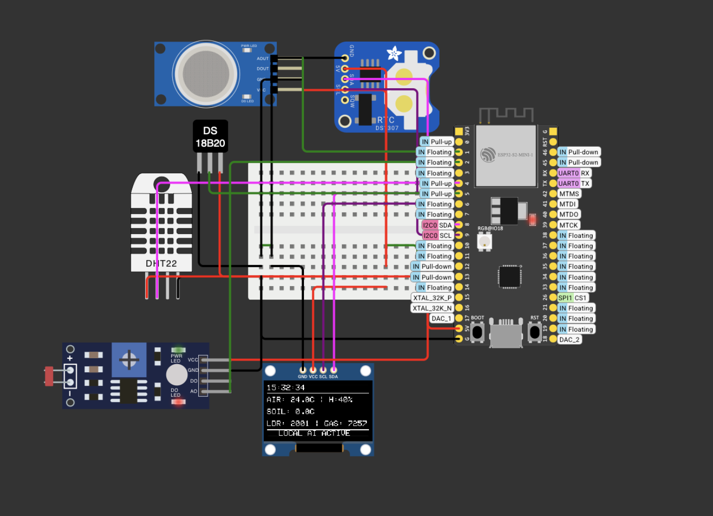
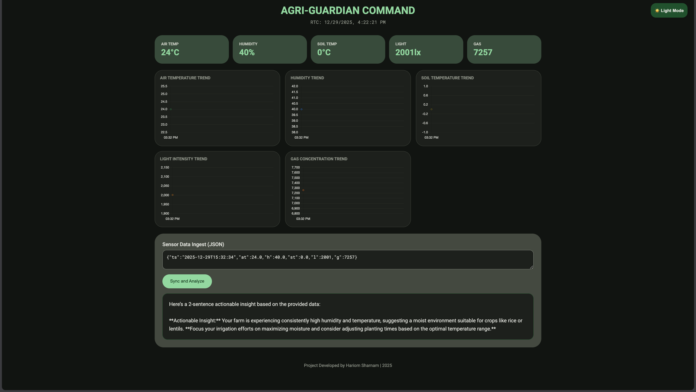

# Agri Guardian

Agri Guardian is a GenAI-assisted crop monitoring and decision-support prototype.  
It combines environmental sensing with explainable AI reasoning to provide clear, practical crop guidance instead of opaque or overconfident recommendations.

The project focuses on **interpretability, reliability, and real-world feasibility**, especially for low-connectivity agricultural environments.

---

Agri Guardian processes field-level data such as temperature, humidity, soil temperature, and light intensity, and uses a Generative AI model to:

- Suggest crop-care actions  
- Explain why a recommendation is made  
- Express confidence and uncertainty  
- Provide actionable Do’s and Don’ts  

Rather than acting as a black box, the system makes its reasoning visible.

---

## Tools & Technologies Used

**Hardware (Prototype / Simulated)**
- ESP32
- DHT22 – Temperature & Humidity
- DS18B20 – Soil Temperature
- LDR – Light Intensity
- OLED Display
- MQ-series Gas Sensor (environment safety indicator)

**Software & AI**
- HTML, CSS, JavaScript (Dashboard)
- Local GenAI using LM Studio
- OpenAI-compatible API workflow (Gemma-compatible)
- Python (local proxy for browser ↔ AI communication)
- Wokwi (used during simulation and testing)

---

## How AI Is Used

AI is used for **contextual reasoning**, not simple threshold checks.

The GenAI model:
- Interprets multiple environmental signals together  
- Weighs conflicting conditions  
- Explains decisions in human-readable language  
- Outputs confidence levels to reflect uncertainty  

This improves trust and transparency compared to rule-only systems.

---

## Demo Images

### sensor view

### Dashbord

---

## System Flow

1. Environmental data is collected (real or simulated)
2. Data is structured and passed to the AI reasoning layer
3. GenAI generates:
   - Decision
   - Confidence score
   - Reasoning
   - Do’s and Don’ts
4. Output is displayed on a web-based dashboard

---

## Hackathon Context

Built for the **GenAI Hackathon Hajipur** under the **AgriTech** theme, aligned with Google’s GenAI ecosystem and responsible AI practices.

---

## Current Status

- Core system working
- Local GenAI integration complete
- Dashboard UI functional
- Cloud-ready architecture (Gemini-compatible)

---

## Future Scope

- Live sensor streaming from hardware
- Crop-specific growth-stage models
- Multilingual advisory output
- Mobile-first deployment
- Cloud scaling using Gemini API

---

This project is a hackathon prototype focused on clear reasoning, stability, and explainability over feature count or visual complexity.
